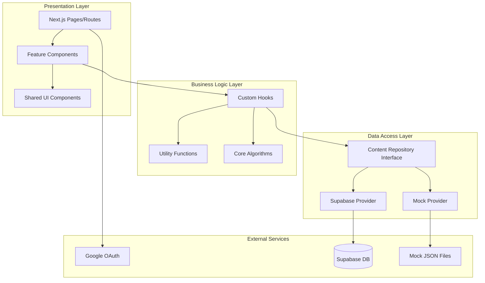

# Design Document: PLC Việt Nam

## Overview

PLC Việt Nam is a technical blog platform specialized in industrial automation content (PLC, SCADA, Siemens). The system enables readers to browse hierarchical content (Fields → Categories → Posts), search articles, leave comments via Google OAuth, and access technical books and resources.

### Key Design Goals

1. **Feature-based architecture**: Self-contained feature modules with clear boundaries
2. **Data abstraction**: Seamless switching between mock data and Supabase without code changes
3. **Static generation**: Pre-render all content at build time for optimal performance
4. **Responsive design**: Mobile-first approach with progressive enhancement
5. **Accessibility**: WCAG AA compliance for inclusive user experience

### Technology Stack

- **Framework**: Next.js 14+ with App Router
- **Language**: TypeScript (strict mode)
- **Styling**: Tailwind CSS with CSS variables for theming
- **Authentication**: NextAuth.js with Google OAuth provider
- **Data Layer**: Abstraction pattern with Mock and Supabase providers
- **Image Optimization**: Next.js Image component
- **State Management**: React Context for theme and auth state
- **Testing**: Vitest for unit tests, fast-check for property-based tests

---

## Architecture

### High-Level Architecture



### Feature-Based Folder Structure

```
app/
├── (routes)/
│   ├── page.tsx                    # Homepage
│   ├── fields/
│   │   └── [fieldSlug]/
│   │       └── [categorySlug]/
│   │           ├── page.tsx        # Category listing
│   │           └── [postSlug]/
│   │               └── page.tsx    # Post detail
│   ├── tags/
│   │   └── [tagSlug]/
│   │       └── page.tsx            # Tag listing
│   ├── books/
│   │   └── page.tsx                # Books page
│   ├── about/
│   │   └── page.tsx                # About page
│   ├── search/
│   │   └── page.tsx                # Search results
│   ├── not-found.tsx               # 404 page
│   └── error.tsx                   # 500 page
├── api/
│   ├── auth/
│   │   └── [...nextauth]/
│   │       └── route.ts            # NextAuth config
│   └── comments/
│       └── route.ts                # Comment submission
├── layout.tsx                      # Root layout
└── globals.css                     # Global styles

features/
├── navigation/
│   ├── components/
│   │   ├── NavigationTree.tsx
│   │   ├── NavigationNode.tsx
│   │   └── NavigationSearch.tsx
│   ├── hooks/
│   │   └── useNavigationTree.ts
│   └── types.ts
├── posts/
│   ├── components/
│   │   ├── PostCard.tsx
│   │   ├── PostList.tsx
│   │   ├── PostDetail.tsx
│   │   ├── PostContent.tsx
│   │   ├── TableOfContents.tsx
│   │   ├── RelatedPosts.tsx
│   │   └── SocialShare.tsx
│   ├── hooks/
│   │   ├── usePost.ts
│   │   ├── useRelatedPosts.ts
│   │   └── useReadingTime.ts
│   ├── utils/
│   │   ├── readingTime.ts
│   │   └── contentParser.ts
│   └── types.ts
├── comments/
│   ├── components/
│   │   ├── CommentSection.tsx
│   │   ├── CommentList.tsx
│   │   ├── CommentForm.tsx
│   │   └── SignInButton.tsx
│   ├── hooks/
│   │   └── useComments.ts
│   └── types.ts
├── books/
│   ├── components/
│   │   ├── BookCard.tsx
│   │   └── BookList.tsx
│   ├── hooks/
│   │   └── useBooks.ts
│   └── types.ts
├── search/
│   ├── components/
│   │   ├── SearchInput.tsx
│   │   ├── SearchResults.tsx
│   │   └── SearchResultItem.tsx
│   ├── hooks/
│   │   └── useSearch.ts
│   ├── utils/
│   │   └── searchEngine.ts
│   └── types.ts
└── tags/
    ├── components/
    │   └── TagList.tsx
    ├── hooks/
    │   └── useTagPosts.ts
    └── types.ts

lib/
├── data/
│   ├── repository.ts               # Repository interface
│   ├── providers/
│   │   ├── mock/
│   │   │   ├── index.ts
│   │   │   └── mockData.ts
│   │   └── supabase/
│   │       └── index.ts
│   └── factory.ts                  # Provider factory
├── auth/
│   └── config.ts                   # NextAuth configuration
├── theme/
│   ├── ThemeProvider.tsx
│   └── useTheme.ts
└── types/
    └── domain.ts                   # Shared domain types

public/
├── mock-data/
│   ├── fields.json
│   ├── categories.json
│   ├── posts.json
│   ├── books.json
│   └── authors.json
└── images/
    └── placeholders/
```

---

## Components and Interfaces

### Core Components

#### 1. NavigationTree Component

**Purpose**: Display hierarchical content structure (Fields → Categories → Posts)

**Props**:
```typescript
interface NavigationTreeProps {
  initialExpanded?: string[];  // Initially expanded node IDs
  onNodeClick?: (node: NavigationNode) => void;
  searchable?: boolean;        // Show search input for >10 fields
}
```

**Behavior**:
- Lazy load categories when field is expanded
- Lazy load posts when category is expanded
- Persist expansion state in localStorage
- Highlight active node based on current route
- Collapse/expand animation with smooth transitions

#### 2. PostCard Component

**Purpose**: Display post summary in lists

**Props**:
```typescript
interface PostCardProps {
  post: Post;
  variant?: 'default' | 'compact' | 'featured';
  showCategory?: boolean;
  showThumbnail?: boolean;
}
```

**Displays**:
- Title (truncated to 2 lines)
- Excerpt (max 200 chars)
- Publication date
- Reading time
- Category name (if showCategory)
- Thumbnail image (if available and showThumbnail)

#### 3. PostDetail Component

**Purpose**: Render full post content with rich media

**Props**:
```typescript
interface PostDetailProps {
  post: Post;
  relatedPosts: Post[];
}
```

**Features**:
- Breadcrumb navigation
- Table of contents (auto-generated from headings)
- Inline images with Next.js Image optimization
- Embedded YouTube videos (responsive 16:9)
- Social sharing buttons
- Tag list
- Related posts section
- Comment section
- Previous/Next post navigation

#### 4. CommentSection Component

**Purpose**: Display comments and handle authentication

**Props**:
```typescript
interface CommentSectionProps {
  postId: string;
  postSlug: string;
}
```

**States**:
- Unauthenticated: Show "Sign in with Google" button
- Authenticated: Show comment form and user info
- Loading: Show skeleton placeholders
- Error: Show error message with retry button

#### 6. BookCard Component

**Purpose**: Display book summary in grid or list layout

**Props**:
```typescript
interface BookCardProps {
  book: Book;
  variant?: 'grid' | 'list';
}
```

**Displays**:
- Cover image (optimized with Next.js Image)
- Title
- Description (max 300 chars, truncated)
- Author name
- Series badge (if part of series)
- Download/External link button

**Behavior**:
- Click on card navigates to book detail or opens external link in new tab
- Download button triggers file download
- External link opens in new tab with `rel="noopener noreferrer"`

#### 7. BookList Component

**Purpose**: Display paginated list of books with optional series grouping

**Props**:
```typescript
interface BookListProps {
  books: Book[];
  groupBySeries?: boolean;
  pagination?: {
    page: number;
    totalPages: number;
    onPageChange: (page: number) => void;
  };
}
```

**Features**:
- Grid layout (3 columns on desktop, 2 on tablet, 1 on mobile)
- Series grouping: Group books by `series` field when enabled
- Pagination: 12 books per page
- Empty state: "Chưa có sách nào" when no books available

#### 8. Homepage Components

**Purpose**: Display homepage sections

**HeroSection**:
```typescript
interface HeroSectionProps {
  title: string;
  tagline: string;
  description: string;
}
```
- Large heading with blog title
- Tagline (e.g., "Chia sẻ kiến thức tự động hóa công nghiệp")
- Brief description of blog focus area
- CTA button to browse content

**RecentPostsSection**:
```typescript
interface RecentPostsSectionProps {
  posts: Post[];  // 6 most recent
}
```
- Section heading: "Bài viết mới nhất"
- Grid of 6 PostCard components (variant='compact')
- "Xem tất cả" link to all posts

**FieldsSection**:
```typescript
interface FieldsSectionProps {
  fields: Field[];
}
```
- Section heading: "Lĩnh vực"
- Grid of field cards showing name, icon, and post count
- Click navigates to field's first category page

**FeaturedBooksSection**:
```typescript
interface FeaturedBooksSectionProps {
  books: Book[];  // 3 featured
}
```
- Section heading: "Sách nổi bật"
- Horizontal carousel of 3 BookCard components
- "Xem tất cả sách" link to books page

#### 9. AboutPage Component

**Purpose**: Display author information and credentials

**Props**:
```typescript
interface AboutPageProps {
  author: Author;
}
```

**Layout**:
- Hero section:
  - Large avatar image (circular, 200x200px)
  - Author name (h1)
  - Professional title
- Bio section:
  - Full biography text
  - Formatted with paragraphs
- Expertise section:
  - "Chuyên môn" heading
  - Tag list of expertise areas
- Certifications section:
  - "Chứng chỉ" heading
  - List of certifications with icons
- Contact section:
  - "Liên hệ" heading
  - Social links (email, LinkedIn, GitHub, Twitter)
  - Each link opens in new tab with appropriate icon

#### 10. TagPage Component

**Purpose**: Display posts filtered by tag

**Props**:
```typescript
interface TagPageProps {
  tag: Tag;
  posts: PaginatedResult<Post>;
}
```

**Layout**:
- Page heading: Tag name
- Subheading: "{postCount} bài viết"
- PostList component with pagination (20 posts/page)
- Breadcrumb: Home → Tags → {tag name}

#### 11. SocialShare Component

**Purpose**: Provide social sharing buttons for posts

**Props**:
```typescript
interface SocialShareProps {
  url: string;
  title: string;
}
```

**Features**:
- Share buttons for Facebook, LinkedIn, Twitter/X
- Copy link button with clipboard API
- Confirmation toast "Đã sao chép!" (2 seconds)

**Share URLs**:
```typescript
const shareUrls = {
  facebook: `https://www.facebook.com/sharer/sharer.php?u=${encodeURIComponent(url)}`,
  linkedin: `https://www.linkedin.com/sharing/share-offsite/?url=${encodeURIComponent(url)}`,
  twitter: `https://twitter.com/intent/tweet?text=${encodeURIComponent(title)}&url=${encodeURIComponent(url)}`
};
```

**Copy to Clipboard**:
```typescript
const handleCopyLink = async () => {
  await navigator.clipboard.writeText(url);
  showToast('Đã sao chép!', 2000);
};
```

#### 5. SearchInput Component

**Purpose**: Global search with live results

**Props**:
```typescript
interface SearchInputProps {
  variant?: 'navbar' | 'overlay';
  onResultClick?: () => void;  // Close overlay on mobile
  debounceMs?: number;         // Default 300ms
}
```

**Behavior**:
- Debounce input (300ms) using custom hook or lodash.debounce
- Show results dropdown after 2+ characters
- Group results by type (Posts, Books)
- Keyboard navigation:
  - Arrow Up/Down: Navigate through results
  - Enter: Navigate to selected result
  - Escape: Close dropdown/overlay
- Mobile: Full-screen overlay with backdrop
- Empty state: Display "Không tìm thấy kết quả cho '[keyword]'" when no results
- Response time: Display results within 500ms of last keystroke

**Implementation Notes**:
```typescript
// Debounce hook
const debouncedQuery = useDebounce(query, 300);

// Keyboard handler
const handleKeyDown = (e: KeyboardEvent) => {
  if (e.key === 'ArrowDown') setSelectedIndex(prev => Math.min(prev + 1, results.length - 1));
  if (e.key === 'ArrowUp') setSelectedIndex(prev => Math.max(prev - 1, 0));
  if (e.key === 'Enter' && selectedIndex >= 0) navigateToResult(results[selectedIndex]);
  if (e.key === 'Escape') closeDropdown();
};
```

---

## Data Models

### Domain Entities

```typescript
// lib/types/domain.ts

export interface Field {
  id: string;
  slug: string;
  name: string;
  description: string;
  icon?: string;
  postCount: number;
  createdAt: Date;
  updatedAt: Date;
}

export interface Category {
  id: string;
  slug: string;
  name: string;
  description: string;
  fieldId: string;
  field?: Field;
  postCount: number;
  order: number;
  createdAt: Date;
  updatedAt: Date;
}

export interface Post {
  id: string;
  slug: string;
  title: string;
  excerpt: string;
  content: string;              // Markdown or HTML
  thumbnailUrl?: string;
  categoryId: string;
  category?: Category;
  authorId: string;
  author?: Author;
  tags: Tag[];
  publishedAt: Date;
  updatedAt: Date;
  viewCount: number;
  readingTimeMinutes: number;   // Calculated field
  seo: SEOMetadata;
}

export interface Tag {
  id: string;
  slug: string;
  name: string;
  postCount: number;
}

export interface Book {
  id: string;
  slug: string;
  title: string;
  description: string;
  coverImageUrl: string;
  authorName: string;
  series?: string;
  downloadUrl?: string;
  externalUrl?: string;
  publishedYear?: number;
  createdAt: Date;
}

export interface Author {
  id: string;
  name: string;
  email: string;
  bio: string;
  avatarUrl?: string;
  expertise: string[];
  certifications: string[];
  socialLinks: SocialLinks;
}

export interface Comment {
  id: string;
  postId: string;
  userId: string;
  userName: string;
  userAvatar?: string;
  content: string;
  createdAt: Date;
  updatedAt: Date;
}

export interface SEOMetadata {
  title: string;
  description: string;
  ogImage?: string;
  keywords: string[];
}

export interface SocialLinks {
  email?: string;
  linkedin?: string;
  github?: string;
  twitter?: string;
}

export interface NavigationNode {
  id: string;
  type: 'field' | 'category' | 'post';
  label: string;
  slug: string;
  url: string;
  children?: NavigationNode[];
  postCount?: number;
}
```

### Repository Interface

```typescript
// lib/data/repository.ts

export interface ContentRepository {
  // Fields
  getFields(): Promise<Field[]>;
  getFieldBySlug(slug: string): Promise<Field | null>;
  
  // Categories
  getCategoriesByFieldId(fieldId: string): Promise<Category[]>;
  getCategoryBySlug(fieldSlug: string, categorySlug: string): Promise<Category | null>;
  
  // Posts
  getPosts(options?: PostQueryOptions): Promise<PaginatedResult<Post>>;
  getPostBySlug(fieldSlug: string, categorySlug: string, postSlug: string): Promise<Post | null>;
  getPostsByCategory(categoryId: string, options?: PostQueryOptions): Promise<PaginatedResult<Post>>;
  getPostsByTag(tagSlug: string, options?: PostQueryOptions): Promise<PaginatedResult<Post>>;
  getRelatedPosts(postId: string, limit: number): Promise<Post[]>;
  getRecentPosts(limit: number): Promise<Post[]>;
  incrementViewCount(postId: string): Promise<void>;
  
  // Tags
  getTags(): Promise<Tag[]>;
  getTagBySlug(slug: string): Promise<Tag | null>;
  
  // Books
  getBooks(options?: BookQueryOptions): Promise<PaginatedResult<Book>>;
  getFeaturedBooks(limit: number): Promise<Book[]>;
  
  // Comments
  getCommentsByPostId(postId: string): Promise<Comment[]>;
  createComment(comment: CreateCommentInput): Promise<Comment>;
  
  // Search
  search(query: string): Promise<SearchResults>;
  
  // Author
  getAuthor(): Promise<Author>;
  
  // Navigation
  getNavigationTree(): Promise<NavigationNode[]>;
}

export interface PostQueryOptions {
  page?: number;
  limit?: number;
  sortBy?: 'publishedAt' | 'viewCount' | 'title';
  sortOrder?: 'asc' | 'desc';
}

export interface BookQueryOptions {
  page?: number;
  limit?: number;
  series?: string;
}

export interface PaginatedResult<T> {
  data: T[];
  pagination: {
    page: number;
    limit: number;
    total: number;
    totalPages: number;
  };
}

export interface SearchResults {
  posts: Post[];
  books: Book[];
  totalResults: number;
}

export interface CreateCommentInput {
  postId: string;
  userId: string;
  userName: string;
  userAvatar?: string;
  content: string;
}
```

### Provider Factory

```typescript
// lib/data/factory.ts

import { ContentRepository } from './repository';
import { MockProvider } from './providers/mock';
import { SupabaseProvider } from './providers/supabase';

export function createContentRepository(): ContentRepository {
  const provider = process.env.DATA_PROVIDER || 'mock';
  
  switch (provider) {
    case 'supabase':
      return new SupabaseProvider();
    case 'mock':
    default:
      return new MockProvider();
  }
}

// Singleton instance
export const contentRepository = createContentRepository();
```

---

## Key Algorithms

### 1. Reading Time Calculation

**Purpose**: Calculate estimated reading time based on word count

**Algorithm**:
```typescript
// features/posts/utils/readingTime.ts

const WORDS_PER_MINUTE = 200;

export function calculateReadingTime(content: string): number {
  // Remove HTML tags
  const plainText = content.replace(/<[^>]*>/g, '');
  
  // Remove extra whitespace
  const normalized = plainText.replace(/\s+/g, ' ').trim();
  
  // Count words (split by whitespace)
  const wordCount = normalized.split(' ').filter(word => word.length > 0).length;
  
  // Calculate minutes, round up
  const minutes = Math.ceil(wordCount / WORDS_PER_MINUTE);
  
  // Minimum 1 minute
  return Math.max(1, minutes);
}
```

**Properties**:
- For any content string, reading time ≥ 1 minute
- For any content string, reading time = ceil(wordCount / 200)
- Empty content returns 1 minute

### 2. Related Posts Algorithm

**Purpose**: Find posts related to current post based on shared tags

**Algorithm**:
```typescript
// features/posts/hooks/useRelatedPosts.ts

export function findRelatedPosts(
  currentPost: Post,
  allPosts: Post[],
  limit: number
): Post[] {
  const currentTagIds = new Set(currentPost.tags.map(t => t.id));
  
  // Score each post by number of shared tags
  const scored = allPosts
    .filter(post => post.id !== currentPost.id)
    .map(post => {
      const sharedTags = post.tags.filter(tag => currentTagIds.has(tag.id)).length;
      const isSameCategory = post.categoryId === currentPost.categoryId;
      
      return {
        post,
        score: sharedTags * 2 + (isSameCategory ? 1 : 0)
      };
    })
    .filter(item => item.score > 0);
  
  // Sort by score descending, then by date descending
  scored.sort((a, b) => {
    if (a.score !== b.score) {
      return b.score - a.score;
    }
    return b.post.publishedAt.getTime() - a.post.publishedAt.getTime();
  });
  
  // If no posts with shared tags, return recent posts from same category
  if (scored.length === 0) {
    return allPosts
      .filter(post => 
        post.id !== currentPost.id && 
        post.categoryId === currentPost.categoryId
      )
      .sort((a, b) => b.publishedAt.getTime() - a.publishedAt.getTime())
      .slice(0, limit);
  }
  
  return scored.slice(0, limit).map(item => item.post);
}
```

**Scoring**:
- Each shared tag: +2 points
- Same category: +1 point
- Fallback: Recent posts from same category if no shared tags

### 3. Client-Side Search (Mock Provider)

**Purpose**: Filter posts and books by keyword

**Algorithm**:
```typescript
// features/search/utils/searchEngine.ts

export function searchContent(
  query: string,
  posts: Post[],
  books: Book[]
): SearchResults {
  const normalizedQuery = query.toLowerCase().trim();
  
  if (normalizedQuery.length < 2) {
    return { posts: [], books: [], totalResults: 0 };
  }
  
  // Search posts
  const matchedPosts = posts.filter(post => {
    const titleMatch = post.title.toLowerCase().includes(normalizedQuery);
    const excerptMatch = post.excerpt.toLowerCase().includes(normalizedQuery);
    const categoryMatch = post.category?.name.toLowerCase().includes(normalizedQuery);
    const tagMatch = post.tags.some(tag => 
      tag.name.toLowerCase().includes(normalizedQuery)
    );
    
    return titleMatch || excerptMatch || categoryMatch || tagMatch;
  });
  
  // Search books
  const matchedBooks = books.filter(book => {
    const titleMatch = book.title.toLowerCase().includes(normalizedQuery);
    const descMatch = book.description.toLowerCase().includes(normalizedQuery);
    
    return titleMatch || descMatch;
  });
  
  return {
    posts: matchedPosts,
    books: matchedBooks,
    totalResults: matchedPosts.length + matchedBooks.length
  };
}
```

**Search Fields**:
- Posts: title, excerpt, category name, tag names
- Books: title, description

### 4. Table of Contents Generation

**Purpose**: Extract headings from post content to generate TOC

**Algorithm**:
```typescript
// features/posts/utils/contentParser.ts

export interface TOCItem {
  id: string;
  level: number;
  text: string;
  children: TOCItem[];
}

export function generateTableOfContents(htmlContent: string): TOCItem[] {
  const parser = new DOMParser();
  const doc = parser.parseFromString(htmlContent, 'text/html');
  const headings = doc.querySelectorAll('h2, h3, h4');
  
  if (headings.length < 3) {
    return [];
  }
  
  const items: TOCItem[] = [];
  const stack: TOCItem[] = [];
  
  headings.forEach((heading, index) => {
    const level = parseInt(heading.tagName.substring(1));
    const text = heading.textContent || '';
    const id = heading.id || `heading-${index}`;
    
    // Ensure heading has ID for anchor links
    if (!heading.id) {
      heading.id = id;
    }
    
    const item: TOCItem = { id, level, text, children: [] };
    
    // Find parent in stack
    while (stack.length > 0 && stack[stack.length - 1].level >= level) {
      stack.pop();
    }
    
    if (stack.length === 0) {
      items.push(item);
    } else {
      stack[stack.length - 1].children.push(item);
    }
    
    stack.push(item);
  });
  
  return items;
}
```

---

## Mock Data Structure

### Mock Data Files

```typescript
// public/mock-data/fields.json
[
  {
    "id": "field-1",
    "slug": "plc",
    "name": "PLC Programming",
    "description": "Programmable Logic Controllers",
    "icon": "cpu",
    "postCount": 45,
    "createdAt": "2024-01-01T00:00:00Z",
    "updatedAt": "2024-01-01T00:00:00Z"
  }
]

// public/mock-data/categories.json
[
  {
    "id": "cat-1",
    "slug": "ladder-logic",
    "name": "Ladder Logic",
    "description": "Ladder diagram programming",
    "fieldId": "field-1",
    "postCount": 15,
    "order": 1,
    "createdAt": "2024-01-01T00:00:00Z",
    "updatedAt": "2024-01-01T00:00:00Z"
  }
]

// public/mock-data/posts.json
[
  {
    "id": "post-1",
    "slug": "introduction-to-ladder-logic",
    "title": "Introduction to Ladder Logic Programming",
    "excerpt": "Learn the fundamentals of ladder logic...",
    "content": "<h2>What is Ladder Logic?</h2><p>...</p>",
    "thumbnailUrl": "/images/posts/ladder-logic-intro.jpg",
    "categoryId": "cat-1",
    "authorId": "author-1",
    "tagIds": ["tag-1", "tag-2"],
    "publishedAt": "2024-01-15T10:00:00Z",
    "updatedAt": "2024-01-15T10:00:00Z",
    "viewCount": 0,
    "seo": {
      "title": "Introduction to Ladder Logic Programming",
      "description": "Learn the fundamentals of ladder logic...",
      "keywords": ["ladder logic", "PLC", "programming"]
    }
  }
]

// public/mock-data/books.json
[
  {
    "id": "book-1",
    "slug": "plc-handbook",
    "title": "PLC Programming Handbook",
    "description": "Comprehensive guide to PLC programming",
    "coverImageUrl": "/images/books/plc-handbook.jpg",
    "authorName": "John Doe",
    "series": "Industrial Automation Series",
    "downloadUrl": "/downloads/plc-handbook.pdf",
    "publishedYear": 2023,
    "createdAt": "2024-01-01T00:00:00Z"
  }
]

// public/mock-data/authors.json
{
  "id": "author-1",
  "name": "Nguyễn Văn A",
  "email": "contact@automation-blog.com",
  "bio": "Chuyên gia tự động hóa công nghiệp với 15 năm kinh nghiệm...",
  "avatarUrl": "/images/author-avatar.jpg",
  "expertise": ["PLC Programming", "SCADA Systems", "Siemens TIA Portal"],
  "certifications": [
    "Siemens Certified Programmer",
    "Rockwell Automation Certified"
  ],
  "socialLinks": {
    "email": "contact@automation-blog.com",
    "linkedin": "https://linkedin.com/in/...",
    "github": "https://github.com/..."
  }
}
```

### Mock Provider Implementation

```typescript
// lib/data/providers/mock/index.ts

import { ContentRepository, PaginatedResult, SearchResults } from '../../repository';
import fieldsData from '@/public/mock-data/fields.json';
import categoriesData from '@/public/mock-data/categories.json';
import postsData from '@/public/mock-data/posts.json';
import booksData from '@/public/mock-data/books.json';
import tagsData from '@/public/mock-data/tags.json';
import authorData from '@/public/mock-data/authors.json';

export class MockProvider implements ContentRepository {
  private fields: Field[];
  private categories: Category[];
  private posts: Post[];
  private books: Book[];
  private tags: Tag[];
  private author: Author;
  private comments: Map<string, Comment[]>;
  
  constructor() {
    // Load and transform mock data
    this.fields = fieldsData.map(this.transformField);
    this.categories = categoriesData.map(this.transformCategory);
    this.posts = postsData.map(this.transformPost);
    this.books = booksData.map(this.transformBook);
    this.tags = tagsData.map(this.transformTag);
    this.author = this.transformAuthor(authorData);
    this.comments = new Map();
    
    // Establish relationships
    this.linkRelationships();
  }
  
  private linkRelationships() {
    // Link categories to fields
    this.categories.forEach(category => {
      category.field = this.fields.find(f => f.id === category.fieldId);
    });
    
    // Link posts to categories and tags
    this.posts.forEach(post => {
      post.category = this.categories.find(c => c.id === post.categoryId);
      post.author = this.author;
      post.tags = this.tags.filter(tag => 
        (post as any).tagIds?.includes(tag.id)
      );
      post.readingTimeMinutes = calculateReadingTime(post.content);
    });
  }
  
  async getFields(): Promise<Field[]> {
    return this.fields;
  }
  
  async getPostBySlug(
    fieldSlug: string, 
    categorySlug: string, 
    postSlug: string
  ): Promise<Post | null> {
    return this.posts.find(post => 
      post.slug === postSlug &&
      post.category?.slug === categorySlug &&
      post.category?.field?.slug === fieldSlug
    ) || null;
  }
  
  async getRelatedPosts(postId: string, limit: number): Promise<Post[]> {
    const currentPost = this.posts.find(p => p.id === postId);
    if (!currentPost) return [];
    
    return findRelatedPosts(currentPost, this.posts, limit);
  }
  
  async search(query: string): Promise<SearchResults> {
    return searchContent(query, this.posts, this.books);
  }
  
  async incrementViewCount(postId: string): Promise<void> {
    // Store in localStorage for mock provider
    if (typeof window !== 'undefined') {
      const key = `post-views-${postId}`;
      const current = parseInt(localStorage.getItem(key) || '0');
      localStorage.setItem(key, (current + 1).toString());
    }
  }
  
  // ... other methods
}
```

---

## Correctness Properties

*A property is a characteristic or behavior that should hold true across all valid executions of a system—essentially, a formal statement about what the system should do. Properties serve as the bridge between human-readable specifications and machine-verifiable correctness guarantees.*

### Property 1: Reading Time Calculation Correctness

*For any* post content string, the calculated reading time SHALL equal the ceiling of (word count / 200) with a minimum value of 1 minute.

**Validates: Requirements 13.2**

**Rationale**: Reading time is a pure function that should produce consistent results for any input. The calculation must handle edge cases like empty content, HTML tags, and excessive whitespace.

**Test Strategy**: Generate random content strings with varying characteristics (plain text, HTML, whitespace, empty), verify the calculation matches the formula and respects the minimum.

---

### Property 2: Comment Validation Boundaries

*For any* comment content string, the validation SHALL accept strings with length in range [1, 2000] characters and reject strings with length 0 or > 2000 characters.

**Validates: Requirements 4.5, 4.6, 4.7**

**Rationale**: Comment length validation is a boundary condition that must be enforced consistently across all inputs to prevent empty comments and database overflow.

**Test Strategy**: Generate random strings of varying lengths (0, 1, 1000, 2000, 2001, 5000), verify validation accepts valid range and rejects invalid range with appropriate error messages.

---

### Property 3: Table of Contents Hierarchy Preservation

*For any* HTML content with heading elements (h2, h3, h4), the generated table of contents SHALL preserve the hierarchical structure where each heading's level determines its nesting depth, and SHALL only be generated when 3 or more headings exist.

**Validates: Requirements 3.4**

**Rationale**: TOC generation is a tree transformation that must correctly parse heading hierarchy and respect the minimum heading threshold.

**Test Strategy**: Generate random HTML with varying heading structures (nested, flat, mixed levels, <3 headings, ≥3 headings), verify TOC structure matches heading hierarchy and threshold is enforced.

---

### Property 4: Related Posts Algorithm Correctness

*For any* post and collection of posts, the related posts algorithm SHALL return posts that either (a) share at least one tag with the current post, ranked by number of shared tags, or (b) if no shared tags exist, return posts from the same category, and SHALL exclude the current post and respect the specified limit.

**Validates: Requirements 12.4, 12.5**

**Rationale**: Related posts is a scoring and filtering algorithm that must handle both the primary (shared tags) and fallback (same category) cases while enforcing exclusion and limit constraints.

**Test Strategy**: Generate random posts with random tag assignments and categories, verify related posts share tags (or same category if no shared tags), exclude current post, respect limit, and are sorted by score.

---

### Property 5: Search Result Correctness

*For any* search query string and collection of posts and books, all returned results SHALL contain the query string (case-insensitive) in at least one of the searchable fields (post title, post excerpt, category name, post tags, book title, book description), and results SHALL be a subset of the input collection.

**Validates: Requirements 9.3, 9.6**

**Rationale**: Search is a filtering operation that must ensure all results match the query and no results are fabricated.

**Test Strategy**: Generate random search queries and content collections, verify all results contain the query substring in searchable fields and results ⊆ input collection.

---

### Property 6: URL Generation Pattern Consistency

*For any* post with associated field slug, category slug, and post slug, the generated URL SHALL follow the pattern `/fields/{field-slug}/{category-slug}/{post-slug}` with all slugs properly URL-encoded.

**Validates: Requirements 10.1**

**Rationale**: URL generation is a string transformation that must produce consistent, valid URLs following the defined pattern.

**Test Strategy**: Generate random posts with various slug characteristics (special characters, spaces, unicode), verify URL matches pattern and slugs are properly encoded.

---

### Property 7: RSS Feed Correctness

*For any* collection of posts, the generated RSS feed SHALL include all required fields (title, publication date, excerpt, URL, author name) for each post, SHALL list posts in descending order by publication date, and SHALL limit results to the 50 most recent posts.

**Validates: Requirements 19.2, 19.3**

**Rationale**: RSS feed generation is a transformation and sorting operation that must include all required metadata, maintain correct sort order, and enforce the limit.

**Test Strategy**: Generate random post collections with varying sizes and publication dates, verify RSS feed includes all required fields, posts are sorted descending by date, and only top 50 are included.

---

## Error Handling

### Error Categories

#### 1. Data Not Found Errors

**Scenarios**:
- Post, category, or field not found by slug
- Tag not found by slug
- Book not found by slug

**Handling**:
- Return `null` from repository methods
- Pages render Next.js `notFound()` to show 404 page
- 404 page displays helpful message with search input and homepage link

**Example**:
```typescript
// app/fields/[fieldSlug]/[categorySlug]/[postSlug]/page.tsx
export default async function PostPage({ params }) {
  const post = await contentRepository.getPostBySlug(
    params.fieldSlug,
    params.categorySlug,
    params.postSlug
  );
  
  if (!post) {
    notFound();  // Renders not-found.tsx
  }
  
  return <PostDetail post={post} />;
}
```

#### 2. Validation Errors

**Scenarios**:
- Comment content empty (0 characters)
- Comment content exceeds 2000 characters
- Search query less than 2 characters

**Handling**:
- Display inline validation error message
- Prevent form submission
- Maintain user input for correction
- Use Zod schema validation

**Example**:
```typescript
const commentSchema = z.object({
  content: z.string()
    .min(1, 'Bình luận không được để trống')
    .max(2000, 'Bình luận không được vượt quá 2000 ký tự')
});
```

#### 3. Authentication Errors

**Scenarios**:
- Google OAuth flow fails
- Session expires during comment submission
- User cancels OAuth consent

**Handling**:
- Display error toast with retry option
- Preserve comment draft in localStorage
- Redirect to sign-in flow on session expiry
- Log errors to monitoring service

**Example**:
```typescript
try {
  await signIn('google');
} catch (error) {
  toast.error('Đăng nhập thất bại. Vui lòng thử lại.');
  console.error('OAuth error:', error);
}
```

#### 4. Network Errors

**Scenarios**:
- API request timeout
- Network connection lost
- Server unavailable (500 error)

**Handling**:
- Display error boundary with retry button
- Show cached content if available (stale-while-revalidate)
- Render custom 500 error page for unhandled errors
- Implement exponential backoff for retries

**Example**:
```typescript
// app/error.tsx
'use client';

export default function Error({ error, reset }) {
  return (
    <div className="error-container">
      <h2>Đã xảy ra lỗi</h2>
      <p>Không thể tải nội dung. Vui lòng thử lại.</p>
      <button onClick={reset}>Thử lại</button>
    </div>
  );
}
```

#### 5. Data Provider Errors

**Scenarios**:
- Mock data file not found or malformed JSON
- Supabase connection failure
- Database query timeout

**Handling**:
- Catch errors at repository layer
- Return empty results or throw typed errors
- Log errors with context for debugging
- Fallback to cached data if available

**Example**:
```typescript
export class MockProvider implements ContentRepository {
  async getPosts(): Promise<Post[]> {
    try {
      const data = await import('@/public/mock-data/posts.json');
      return data.default.map(this.transformPost);
    } catch (error) {
      console.error('Failed to load mock posts:', error);
      return [];  // Graceful degradation
    }
  }
}
```

### Error Monitoring

- Use error boundaries at feature level to isolate failures
- Log errors to console in development
- Send errors to monitoring service (e.g., Sentry) in production
- Include context: user ID, route, provider type, timestamp
- Track error rates and set up alerts for anomalies

---

## Testing Strategy

### Testing Approach

The testing strategy combines **example-based unit tests** for specific scenarios and **property-based tests** for universal correctness guarantees. This dual approach ensures both concrete behavior verification and comprehensive input coverage.

### Unit Testing

**Framework**: Vitest with React Testing Library

**Scope**:
- Component rendering and user interactions
- Hook behavior with specific inputs
- Integration between components
- Edge cases and error conditions

**Examples**:
```typescript
// features/posts/components/__tests__/PostCard.test.tsx
describe('PostCard', () => {
  it('renders post title, excerpt, and metadata', () => {
    const post = createMockPost();
    render(<PostCard post={post} />);
    
    expect(screen.getByText(post.title)).toBeInTheDocument();
    expect(screen.getByText(post.excerpt)).toBeInTheDocument();
    expect(screen.getByText(/phút đọc/)).toBeInTheDocument();
  });
  
  it('navigates to post detail on click', async () => {
    const post = createMockPost();
    const user = userEvent.setup();
    render(<PostCard post={post} />);
    
    await user.click(screen.getByRole('article'));
    
    expect(mockRouter.push).toHaveBeenCalledWith(
      `/fields/${post.category.field.slug}/${post.category.slug}/${post.slug}`
    );
  });
});
```

**Coverage Targets**:
- Components: 80% line coverage
- Hooks: 90% line coverage
- Utils: 95% line coverage

### Property-Based Testing

**Framework**: fast-check

**Scope**: Core algorithms with universal properties (see Correctness Properties section)

**Configuration**:
- Minimum 100 iterations per property test
- Each test tagged with feature name and property number
- Shrinking enabled to find minimal failing examples

**Example**:
```typescript
// features/posts/utils/__tests__/readingTime.property.test.ts
import fc from 'fast-check';
import { calculateReadingTime } from '../readingTime';

/**
 * Feature: automation-blog, Property 1: Reading Time Calculation Correctness
 * 
 * For any post content string, the calculated reading time SHALL equal 
 * the ceiling of (word count / 200) with a minimum value of 1 minute.
 */
describe('Property: Reading Time Calculation', () => {
  it('should calculate reading time as ceil(wordCount / 200) with minimum 1', () => {
    fc.assert(
      fc.property(
        fc.string(),  // Generate random content
        (content) => {
          const result = calculateReadingTime(content);
          
          // Calculate expected value
          const plainText = content.replace(/<[^>]*>/g, '');
          const normalized = plainText.replace(/\s+/g, ' ').trim();
          const wordCount = normalized.split(' ').filter(w => w.length > 0).length;
          const expected = Math.max(1, Math.ceil(wordCount / 200));
          
          expect(result).toBe(expected);
          expect(result).toBeGreaterThanOrEqual(1);
        }
      ),
      { numRuns: 100 }
    );
  });
});
```

**Property Test Tags**:
- Property 1: `features/posts/utils/__tests__/readingTime.property.test.ts`
- Property 2: `features/comments/utils/__tests__/validation.property.test.ts`
- Property 3: `features/posts/utils/__tests__/tableOfContents.property.test.ts`
- Property 4: `features/posts/hooks/__tests__/relatedPosts.property.test.ts`
- Property 5: `features/search/utils/__tests__/searchEngine.property.test.ts`
- Property 6: `features/posts/utils/__tests__/urlGeneration.property.test.ts`
- Property 7: `features/posts/utils/__tests__/rssFeed.property.test.ts`

### Integration Testing

**Scope**:
- Data provider implementations (Mock and Supabase)
- API routes (comments, auth)
- Static generation (generateStaticParams)
- RSS feed generation at build time

**Examples**:
```typescript
// lib/data/providers/__tests__/providers.integration.test.ts
describe('Provider Interface Consistency', () => {
  const providers = [
    new MockProvider(),
    new SupabaseProvider()
  ];
  
  providers.forEach(provider => {
    describe(`${provider.constructor.name}`, () => {
      it('should return posts with consistent structure', async () => {
        const posts = await provider.getPosts({ limit: 10 });
        
        expect(posts.data).toBeInstanceOf(Array);
        posts.data.forEach(post => {
          expect(post).toMatchObject({
            id: expect.any(String),
            slug: expect.any(String),
            title: expect.any(String),
            content: expect.any(String),
            publishedAt: expect.any(Date),
            readingTimeMinutes: expect.any(Number)
          });
        });
      });
    });
  });
});
```

### End-to-End Testing

**Framework**: Playwright (optional, for critical user flows)

**Scope**:
- Homepage → Post detail → Comment flow
- Search → Results → Post detail
- Navigation tree interaction
- Dark mode toggle persistence

**Priority**: Lower priority than unit and property tests; focus on critical paths.

### Test Organization

```
features/
├── posts/
│   ├── components/
│   │   └── __tests__/
│   │       ├── PostCard.test.tsx
│   │       └── PostDetail.test.tsx
│   ├── hooks/
│   │   └── __tests__/
│   │       ├── usePost.test.ts
│   │       └── relatedPosts.property.test.ts
│   └── utils/
│       └── __tests__/
│           ├── readingTime.test.ts
│           ├── readingTime.property.test.ts
│           └── tableOfContents.property.test.ts
└── search/
    └── utils/
        └── __tests__/
            ├── searchEngine.test.ts
            └── searchEngine.property.test.ts
```

### Continuous Integration

- Run all tests on every pull request
- Fail build if coverage drops below thresholds
- Run property tests with increased iterations (500) in CI
- Generate coverage reports and upload to code quality service

### RSS Feed Generation

**Purpose**: Generate RSS 2.0 feed for blog posts

**Implementation**:
```typescript
// app/rss.xml/route.ts
import { contentRepository } from '@/lib/data/factory';

export async function GET() {
  const posts = await contentRepository.getRecentPosts(50);
  const author = await contentRepository.getAuthor();
  
  const rss = `<?xml version="1.0" encoding="UTF-8"?>
<rss version="2.0" xmlns:atom="http://www.w3.org/2005/Atom">
  <channel>
    <title>PLC Việt Nam</title>
    <link>${process.env.NEXT_PUBLIC_SITE_URL}</link>
    <description>Chia sẻ kiến thức tự động hóa công nghiệp</description>
    <language>vi</language>
    <atom:link href="${process.env.NEXT_PUBLIC_SITE_URL}/rss.xml" rel="self" type="application/rss+xml" />
    ${posts.map(post => `
    <item>
      <title>${escapeXml(post.title)}</title>
      <link>${process.env.NEXT_PUBLIC_SITE_URL}/fields/${post.category.field.slug}/${post.category.slug}/${post.slug}</link>
      <description>${escapeXml(post.excerpt)}</description>
      <pubDate>${post.publishedAt.toUTCString()}</pubDate>
      <author>${escapeXml(author.email)} (${escapeXml(author.name)})</author>
      <guid isPermaLink="true">${process.env.NEXT_PUBLIC_SITE_URL}/fields/${post.category.field.slug}/${post.category.slug}/${post.slug}</guid>
    </item>
    `).join('')}
  </channel>
</rss>`;

  return new Response(rss, {
    headers: {
      'Content-Type': 'application/rss+xml; charset=utf-8',
      'Cache-Control': 'public, max-age=3600, s-maxage=3600'
    }
  });
}

function escapeXml(str: string): string {
  return str
    .replace(/&/g, '&amp;')
    .replace(/</g, '&lt;')
    .replace(/>/g, '&gt;')
    .replace(/"/g, '&quot;')
    .replace(/'/g, '&apos;');
}
```

**RSS Link in Layout**:
```typescript
// app/layout.tsx
export default function RootLayout({ children }) {
  return (
    <html>
      <head>
        <link 
          rel="alternate" 
          type="application/rss+xml" 
          title="PLC Việt Nam RSS Feed" 
          href="/rss.xml" 
        />
      </head>
      <body>{children}</body>
    </html>
  );
}
```

**Build-time Generation (Mock Provider)**:
For static export, generate RSS at build time:
```typescript
// scripts/generate-rss.ts
import fs from 'fs';
import { MockProvider } from '@/lib/data/providers/mock';

async function generateRSS() {
  const provider = new MockProvider();
  const posts = await provider.getRecentPosts(50);
  // ... generate RSS XML
  fs.writeFileSync('public/rss.xml', rss);
}

generateRSS();
```

---

## Implementation Notes

### Performance Considerations

1. **Static Generation**: Pre-render all post pages at build time using `generateStaticParams` to minimize server load and improve Time to First Byte (TTFB).

2. **Image Optimization**: Use Next.js Image component with appropriate `sizes` attribute for responsive images. Serve images in WebP format with JPEG fallback.

3. **Code Splitting**: Leverage Next.js automatic code splitting. Lazy load heavy components (comment section, search overlay) using `React.lazy` and `Suspense`.

4. **Data Fetching**: Use React Server Components for data fetching to reduce client-side JavaScript. Cache repository responses with appropriate revalidation intervals.

5. **Search Optimization**: For mock provider, implement client-side search with debouncing (300ms). For Supabase provider, use full-text search with indexed columns.

### Accessibility Requirements

1. **Keyboard Navigation**: All interactive elements must be keyboard accessible. Implement focus management for modals and overlays.

2. **Screen Reader Support**: Use semantic HTML and ARIA labels. Announce dynamic content changes (search results, comment submission).

3. **Color Contrast**: Ensure WCAG AA compliance (4.5:1 for normal text, 3:1 for large text) in both light and dark modes.

4. **Focus Indicators**: Provide visible focus indicators for all interactive elements. Use `:focus-visible` to show indicators only for keyboard navigation.

5. **Alternative Text**: All images must have descriptive alt text. Decorative images should have empty alt attribute.

### Security Considerations

1. **Content Sanitization**: Sanitize user-generated content (comments) to prevent XSS attacks. Use DOMPurify or similar library.

2. **Authentication**: Use NextAuth.js with secure session management. Store session tokens in httpOnly cookies.

3. **Rate Limiting**: Implement rate limiting for comment submission (max 5 comments per minute per user) to prevent spam.

4. **CSRF Protection**: NextAuth.js provides built-in CSRF protection. Ensure all state-changing operations use POST requests.

5. **Environment Variables**: Store sensitive credentials (Supabase keys, OAuth secrets) in environment variables. Never commit to version control.

### Deployment Strategy

1. **Environment Setup**:
   - Development: `DATA_PROVIDER=mock`
   - Staging: `DATA_PROVIDER=supabase` with test database
   - Production: `DATA_PROVIDER=supabase` with production database

2. **Build Process**:
   - Run type checking: `tsc --noEmit`
   - Run linting: `eslint . --ext .ts,.tsx`
   - Run tests: `vitest run`
   - Build application: `next build`
   - Generate sitemap and RSS feed

3. **Deployment Platforms**:
   - Recommended: Vercel (optimal Next.js support)
   - Alternative: Netlify, AWS Amplify, self-hosted

4. **Monitoring**:
   - Set up error tracking (Sentry)
   - Monitor Core Web Vitals (Vercel Analytics)
   - Track user analytics (privacy-friendly option: Plausible)

---

## Future Enhancements

### Phase 2 Features (Post-MVP)

1. **Advanced Search**: Full-text search with filters (date range, category, tags), search suggestions, and search history.

2. **User Profiles**: Allow readers to create profiles, save favorite posts, and track reading history.

3. **Email Notifications**: Notify subscribers of new posts via email. Implement RSS-to-email service.

4. **Content Recommendations**: Machine learning-based content recommendations based on reading history and preferences.

5. **Multi-language Support**: Internationalization (i18n) for Vietnamese and English content.

6. **Admin Dashboard**: Content management interface for creating and editing posts, categories, and books without code changes.

7. **Comment Moderation**: Admin interface for reviewing, approving, and deleting comments. Implement spam detection.

8. **Analytics Dashboard**: Display post views, popular content, and reader engagement metrics.

### Technical Debt and Refactoring

1. **Migration to Supabase**: Complete Supabase provider implementation and migrate from mock data.

2. **Performance Optimization**: Implement incremental static regeneration (ISR) for frequently updated content.

3. **Test Coverage**: Increase test coverage to 90%+ across all modules.

4. **Accessibility Audit**: Conduct comprehensive accessibility audit and address findings.

5. **SEO Optimization**: Implement structured data (JSON-LD), optimize meta tags, and improve Core Web Vitals scores.

---

## Appendix

### Technology Decisions

| Decision | Rationale |
|----------|-----------|
| Next.js App Router | Modern React framework with built-in SSG, routing, and optimization |
| TypeScript | Type safety reduces runtime errors and improves developer experience |
| Tailwind CSS | Utility-first CSS framework for rapid UI development and consistent design |
| NextAuth.js | Industry-standard authentication library with OAuth support |
| Vitest | Fast unit test runner with excellent TypeScript support |
| fast-check | Property-based testing library for comprehensive input coverage |
| Abstraction Layer | Enables development with mock data and seamless migration to Supabase |

### Design Patterns

1. **Repository Pattern**: Abstracts data access behind a consistent interface, enabling provider swapping.

2. **Provider Pattern**: Implements different data sources (Mock, Supabase) with the same interface.

3. **Factory Pattern**: Creates repository instances based on environment configuration.

4. **Composition Pattern**: Builds complex components from smaller, reusable components.

5. **Custom Hooks Pattern**: Encapsulates business logic and state management in reusable hooks.

### Naming Conventions

- **Files**: kebab-case (e.g., `post-card.tsx`, `use-posts.ts`)
- **Components**: PascalCase (e.g., `PostCard`, `NavigationTree`)
- **Functions**: camelCase (e.g., `calculateReadingTime`, `findRelatedPosts`)
- **Constants**: UPPER_SNAKE_CASE (e.g., `WORDS_PER_MINUTE`, `MAX_COMMENT_LENGTH`)
- **Types/Interfaces**: PascalCase (e.g., `Post`, `ContentRepository`)
- **CSS Classes**: Tailwind utilities (no custom classes unless necessary)

### Git Workflow

1. **Branch Naming**: `feature/navigation-tree`, `bugfix/comment-validation`, `refactor/data-layer`
2. **Commit Messages**: Conventional Commits format (e.g., `feat: add reading time calculation`, `fix: correct TOC generation for nested headings`)
3. **Pull Requests**: Require code review, passing tests, and no merge conflicts
4. **Main Branch**: Protected, requires PR approval and CI passing

---

## Conclusion

This design document provides a comprehensive blueprint for implementing the PLC Việt Nam platform. The feature-based architecture ensures scalability and maintainability, while the data abstraction layer enables flexible deployment strategies. The combination of unit tests and property-based tests ensures both concrete behavior verification and universal correctness guarantees.

Key success factors:
- Strict adherence to TypeScript types for compile-time safety
- Comprehensive test coverage with property-based tests for core algorithms
- Accessibility-first approach for inclusive user experience
- Performance optimization through static generation and code splitting
- Clear separation of concerns with feature-based organization

The design is ready for implementation, with clear component boundaries, data models, and testing strategies defined.
