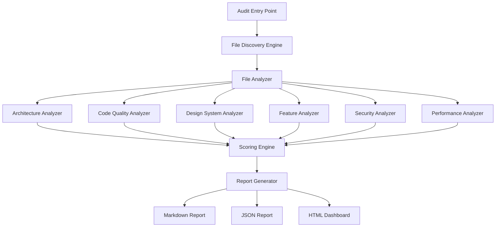

# Design Document: Comprehensive Frontend Audit System

## Tổng quan

Hệ thống audit frontend toàn diện cho dự án PLC Việt Nam - phân tích, đánh giá và báo cáo chi tiết về chất lượng source code, kiến trúc, design system, performance, security, accessibility, và SEO. Hệ thống sẽ kiểm tra 100% files, functions, và dòng code, không bỏ sót bất kỳ thành phần nào.

**Mục tiêu chính:**
- Audit toàn bộ frontend codebase (không bỏ sót file nào)
- Đánh giá architecture, design patterns, scalability
- Kiểm tra feature completeness và page coverage
- Phân tích code quality, security, performance
- Tạo báo cáo chi tiết với scoring system và recommendations

## Kiến trúc hệ thống



## Workflow chính

```mermaid
sequenceDiagram
    participant User
    participant AuditSystem
    participant FileDiscovery
    participant Analyzers
    participant ScoringEngine
    participant ReportGen
    
    User->>AuditSystem: Trigger audit
    AuditSystem->>FileDiscovery: Scan workspace
    FileDiscovery-->>AuditSystem: File list (all files)
    
    loop For each file
        AuditSystem->>Analyzers: Analyze file
        Analyzers-->>AuditSystem: Analysis results
    end
    
    AuditSystem->>ScoringEngine: Calculate scores
    ScoringEngine-->>AuditSystem: Scores + issues
    
    AuditSystem->>ReportGen: Generate reports
    ReportGen-->>User: Audit reports
